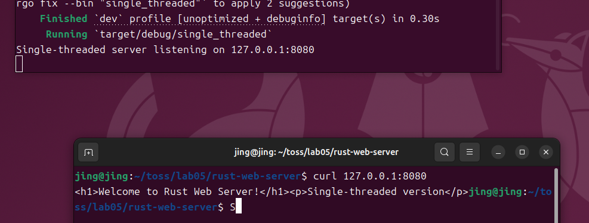
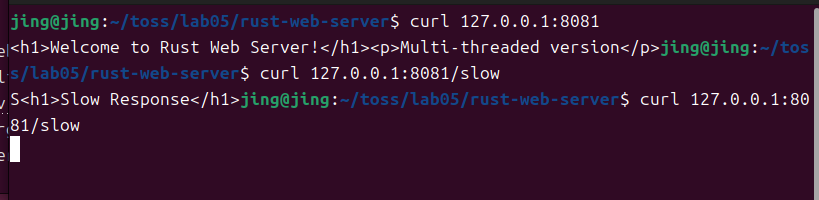
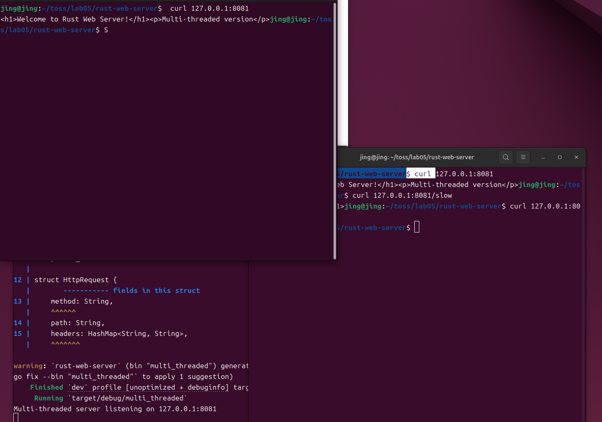
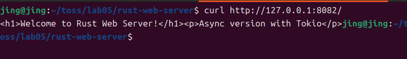

## Lab5 实验报告

## 软2304-20232241467-景奕瑞

### 1. Web 服务器概念和基本实现方法

Web 服务器是一种程序或计算机，它通过 HTTP（超文本传输协议）响应客户端（通常是 Web 浏览器）的请求。它的主要功能是存储、处理和交付 Web 页面给客户端。当用户在浏览器中输入一个网址时，浏览器会向对应的 Web 服务器发送一个 HTTP 请求。服务器接收到请求后，会找到请求的资源（例如 HTML 文件、图片、视频或执行脚本），然后将其通过 HTTP 响应发送回浏览器，浏览器再将这些内容渲染出来。

**基本实现方法：**

1. **套接字（Socket）编程：** Web 服务器通常通过套接字进行网络通信。它会创建一个监听套接字来等待传入的客户端连接请求。
2. **绑定地址和端口：** 服务器需要绑定到一个特定的 IP 地址和端口号，以便客户端知道如何连接到它。
3. **监听连接：** 绑定后，服务器会进入监听状态，等待客户端连接。
4. **接受连接：** 当有客户端尝试连接时，服务器会接受该连接，并为该客户端创建一个新的套接字，用于后续的通信。
5. **读取请求：** 从客户端套接字读取传入的 HTTP 请求数据。
6. **解析请求：** 将原始的 HTTP 请求数据解析成有意义的结构，例如请求方法（GET、POST）、请求路径、请求头等。
7. **处理请求：** 根据请求的路径和方法，服务器执行相应的业务逻辑，例如读取文件、查询数据库、执行计算等。
8. **生成响应：** 根据处理结果，构建 HTTP 响应，包括状态码（如 200 OK, 404 Not Found）、响应头和响应体。
9. **发送响应：** 将 HTTP 响应发送回客户端套接字。
10. **关闭连接：** 完成通信后，关闭客户端套接字。

### 2. Rust 实现 Web 服务器教程学习与代码结构

本实验基于 Rust 语言实现 Web 服务器，主要学习了以下三种并发模型：单线程、多线程和基于 Tokio 的异步 I/O。

**共同的代码结构：**

这三个服务器实现都包含以下核心结构和函数：

- **`HttpRequest` struct:** 用于封装 HTTP 请求的方法 (`method`), 路径 (`path`), 和请求头 (`headers`)。

- **`HttpRequest::parse` method:** 负责解析原始的 HTTP 请求字符串，将其分解为 `HttpRequest` 结构体中的各个字段。它通过查找换行符和冒号来分离请求行和请求头。

- `handle_request` function:

   根据请求的路径返回不同的 HTTP 响应字符串。

  - `"/"`: 返回一个简单的 HTML 欢迎页面。
  - `"/api/hello"`: 返回一个 JSON 格式的 "Hello" 消息。
  - `_` (其他路径): 返回 "404 Not Found" 页面。

### 3. 三种版本的 Web 服务器实现及初步性能对比

#### 3.1 `single_threaded.rs` - 单线程服务器

**实现原理：** `single_threaded.rs` 实现了一个基本的单线程 TCP 服务器。它一次只处理一个客户端连接。服务器通过 `nix::sys::socket` 提供的接口进行 socket 操作，包括创建 socket (`socket`), 绑定地址 (`bind`), 监听连接 (`listen`) 和接受连接 (`accept`)。在主循环中，`accept` 操作是阻塞的，直到接收到一个新的客户端连接。一旦接受，它会阻塞地读取请求 (`read`)，处理请求，然后发送响应 (`write`)，最后关闭连接 (`close`)。

**代码讲解：**

- `main` 函数:
  - 创建 IPv4 的 TCP 流式 socket 并绑定到 `127.0.0.1:8080`。
  - 进入无限循环 (`loop`)，每次循环都会阻塞在 `accept` 调用，直到有新的连接到来。
  - 接受连接后，直接在当前线程内顺序执行读取请求、解析、处理请求、发送响应和关闭连接的操作。
- **特点:** 由于所有操作都在同一个线程中顺序执行，如果一个请求处理时间较长（例如模拟的 `/slow` 路径，虽然此版本没有实现，但如果实现也会阻塞），其他客户端必须等待。这导致其无法并发处理请求。

#### 3.2 `multi_threaded.rs` - 多线程服务器

**实现原理：** `multi_threaded.rs` 在单线程服务器的基础上，引入了多线程来并发处理客户端连接。每次 `accept` 成功接收到一个新的客户端连接后，服务器会使用 `std::thread::spawn` 启动一个新的操作系统线程来处理这个连接。

**代码讲解：**

- **`handle_client` 函数:** 将处理单个客户端连接的逻辑封装起来，由新创建的线程执行。
- `main` 函数:
  - 与单线程版本类似地创建和监听 socket，绑定到 `127.0.0.1:8081`。
  - 在主循环中，每次 `accept`到一个新的 `client_fd` 后，会立即 `thread::spawn` 一个新线程，并将 `client_fd` 移入新线程中进行处理 (`handle_client(client_fd)`)。
- **`/slow` 路径:** 引入了 `/slow` 路径，模拟一个耗时 2 秒的操作 (`thread::sleep(std::time::Duration::from_secs(2))`)。 在多线程环境下，一个慢请求不会阻塞其他请求的处理，因为它们在不同的线程中执行。
- **特点:** 能够并发处理多个客户端请求，提高了并发能力和响应性。但频繁创建和销毁线程会带来一定的开销，并且过多的线程可能会导致资源争用和上下文切换的性能问题。

#### 3.3 `async_tokio.rs` - 基于 Tokio 的异步 I/O 服务器

**实现原理：** `async_tokio.rs` 利用 Rust 的异步编程特性和 Tokio 运行时来构建一个高性能的异步 Web 服务器。异步编程通过事件循环和非阻塞 I/O 来处理并发，而不是为每个连接创建独立的操作系统线程。

**代码讲解：**

- **依赖 `tokio`:** 需要在 `Cargo.toml` 中添加 `tokio` 依赖。
- **异步函数 (`async fn`):** 许多函数（如 `handle_request`, `handle_client`, `main`）都标记为 `async`，这意味着它们是异步的，并且可以 `await` 其他异步操作。
- **`TcpListener` 和 `TcpStream`:** 使用 Tokio 提供的异步版本的 TCP 监听器 (`tokio::net::TcpListener`) 和流 (`tokio::net::TcpStream`)，它们提供非阻塞的 `accept`, `read`, `write` 等操作。
- **`handle_client` 函数 (异步):** 接收 `tokio::net::TcpStream` 作为参数。使用 `stream.read(&mut buffer).await` 和 `stream.write_all(response.as_bytes()).await` 进行异步的读取和写入。`await` 关键字表示当前任务会在这里暂停，等待 I/O 操作完成，而不会阻塞整个线程。
- **`/slow` 路径 (异步):** 使用 `tokio::time::sleep(tokio::time::Duration::from_secs(2)).await;` 来模拟异步慢请求，它不会阻塞当前线程，而是允许 Tokio 运行时在等待期间执行其他任务。
- **`main` 函数 (异步):** 标记为 `#[tokio::main] async fn main()`，`#[tokio::main]` 宏是 Tokio 提供的，用于设置异步运行时。在主循环中，`listener.accept().await?` 异步接受连接，然后使用 `tokio::spawn(async move { handle_client(stream).await; });` 启动一个新的轻量级异步任务（future）来处理客户端连接。
- **特点:** 使用少量操作系统线程（通常与 CPU 核心数相同）来处理大量的并发连接。当一个 I/O 操作被 `await` 时，当前任务会暂停，线程会被释放去处理其他就绪的任务，极大地提高了 I/O 密集型应用的并发处理能力和资源利用率。

#### 3.4 初步性能对比

| 服务器类型     | 端口 | 正常请求 (`/`, `/api/hello`) | 慢请求 (`/slow`) 行为                           | 并发请求 (`/slow` + `/`) 行为                    | 优点                                         | 缺点                                                  | 适用场景                         |
| -------------- | ---- | ---------------------------- | ----------------------------------------------- | ------------------------------------------------ | -------------------------------------------- | ----------------------------------------------------- | -------------------------------- |
| **单线程**     | 8080 | 立即响应                     | 无 `/slow` 支持，任何长请求都会完全阻塞服务器。 | 无法并发处理，一个请求处理时，其他请求必须等待。 | 实现简单，资源消耗低                         | 无法并发，吞吐量低，不适合高并发场景                  | 简单、低并发、I/O操作少          |
| **多线程**     | 8081 | 立即响应                     | 响应时间约为 2 秒。                             | `/slow` 请求执行期间，其他请求可立即响应。       | 实现相对简单，能并发处理请求                 | 线程创建/销毁开销，线程过多时性能下降，资源消耗相对高 | 中等并发，有少量耗时操作         |
| **异步 Tokio** | 8082 | 立即响应                     | 响应时间约为 2 秒，但不会阻塞整个线程。         | `/slow` 请求执行期间，其他请求可立即响应。       | 高并发，I/O 密集型场景性能优异，资源利用率高 | 学习曲线较陡峭，调试相对复杂                          | 高并发、I/O 密集型应用，Web 服务 |

**测试截图**

（单线程服务器测试）

(多线程堵塞测试)

(多线程多客户链接测试)

(异步服务器测试)

**实验观测：**

1. **单线程服务器 (8080):** 正常请求响应迅速。如果添加一个模拟耗时操作的路由，会发现一旦访问该路由，整个服务器会“卡住”2秒，在此期间其他任何请求都无法得到响应。
2. **多线程服务器 (8081):** 正常请求响应迅速。当访问 `/slow` 路径时，请求会等待 2 秒。但同时从另一个终端访问 `/` 或 `/api/hello`，这些请求会立即得到响应，证明了其并发处理能力。
3. **异步 Tokio 服务器 (8082):** 正常请求响应迅速。访问 `/slow` 路径同样会等待 2 秒。但与多线程版本类似，在 `/slow` 请求处理期间，其他请求也能立即得到响应。与多线程不同的是，异步模型通常使用更少的操作系统线程来处理大量并发，提高了资源利用率。

### 4. 总结与体会

通过本次实验，我深入理解了 Web 服务器的基本工作原理，并亲手实现了三种不同并发模型的 Rust Web 服务器：单线程、多线程和异步（基于 Tokio）。

- **单线程服务器**虽然实现最为简单，但在实际应用中几乎没有并发能力，适用于极其简单的场景。
- **多线程服务器**通过为每个连接创建独立的线程，显著提升了并发能力，适用于中等并发量的应用。然而，线程的创建和管理开销会限制其在极高并发场景下的性能。
- **异步 Tokio 服务器**则展示了现代高性能 Web 服务的主流范式。它利用 Rust 的异步特性和 Tokio 强大的运行时，通过事件循环和非阻塞 I/O，以极高的效率处理大量并发连接。这对于 I/O 密集型应用（如 Web 服务器）来说是至关重要的，因为它能够以更少的系统资源提供更高的吞吐量和更低的延迟。

本次实验让我对 Rust 在系统编程和并发处理方面的强大能力有了更直观的认识，特别是 Tokio 框架在简化异步编程复杂性方面的作用。虽然异步编程的学习曲线相对陡峭，但其带来的性能提升是显著的。